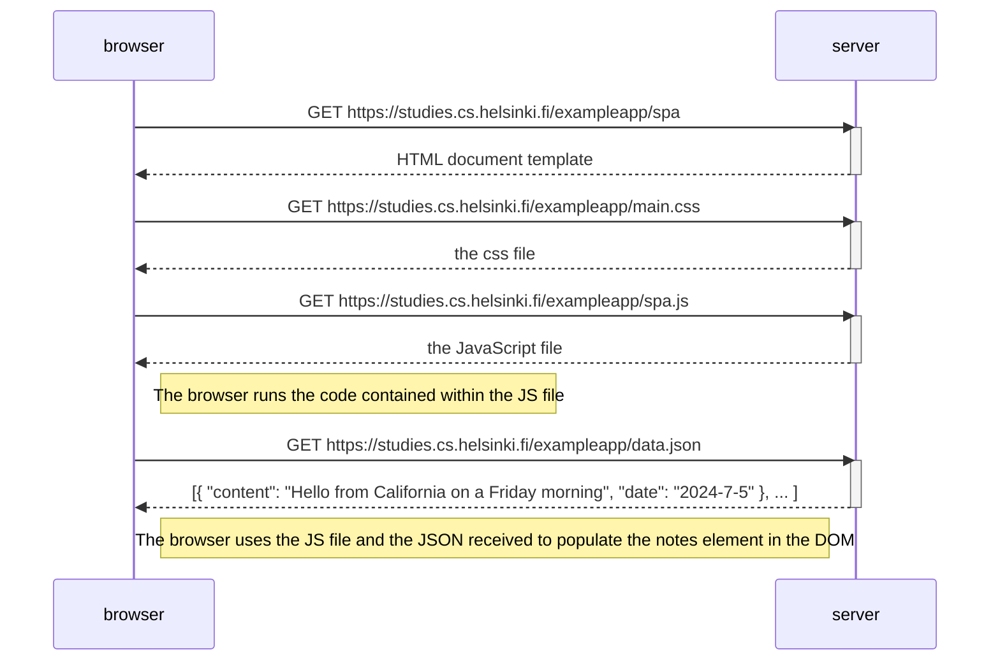

```mermaid
sequenceDiagram
participant browser
participant server

    browser->>server: GET https://studies.cs.helsinki.fi/exampleapp/spa
    
    activate server
    server-->>browser: HTML document template
    deactivate server

    browser->>server: GET https://studies.cs.helsinki.fi/exampleapp/main.css
    
    activate server
    server-->>browser: the css file
    deactivate server

    browser->>server: GET https://studies.cs.helsinki.fi/exampleapp/spa.js
    
    activate server
    server-->>browser: the JavaScript file
    deactivate server

    Note right of browser: The browser runs the code contained within the JS file
    
    browser->>server: GET https://studies.cs.helsinki.fi/exampleapp/data.json
    
    activate server
    server-->>browser: [{ "content": "Hello from California on a Friday morning", "date": "2024-7-5" }, ... ]
    deactivate server
    
    Note right of browser: The browser uses the JS file and the JSON received to populate the notes element in the DOM
```